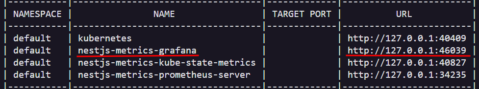
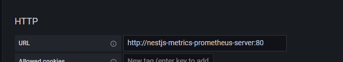
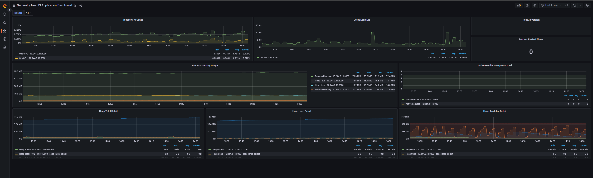

## Description

This is a basic application developed in NestJS together with Prometheus and Gratana to collect metrics.

## Pre requisites

Have kubernetes, minikube and docker instaled on you machine.

## Used tecnologies

- Node
- Nestjs
- NestJS Prometheus
- Prom-client
- Docker
- Kubernetes
- Helm
- Prometheus
- Grafana

## Installation

```bash
# Start minikube cluster
$ minikube start

# Enter on this folder
$ cd k8s/nestjs-metrics

# Install helm dependencies
$ helm dependency update

# Excecute the project
$ helm install nestjs-metrics .
```

## Cofigure grafana

Execute this command so you will get the grafana service port

```bash
$ minikube service --all
```


Open the url then set "admin" as username and to get the password run the command bellow

```bash
$ kubectl get secret nestjs-metrics-grafana -o jsonpath="{.data.admin-password}" | base64 --decode ; echo
```

Enter on "Configuration/Data source" and set prometheus as a data source

Set the Url of Prometheus as http://nestjs-metrics-prometheus-server:80


Import a new dashbord with id "11159" for the NodeJS Application Dashboard

Then you will see a dashboard as follows


